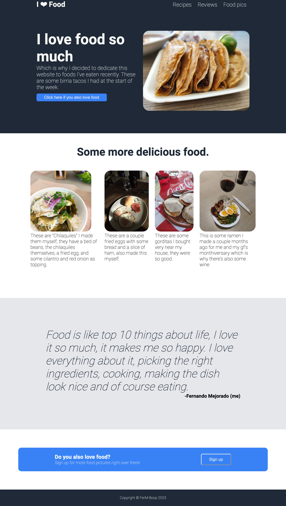
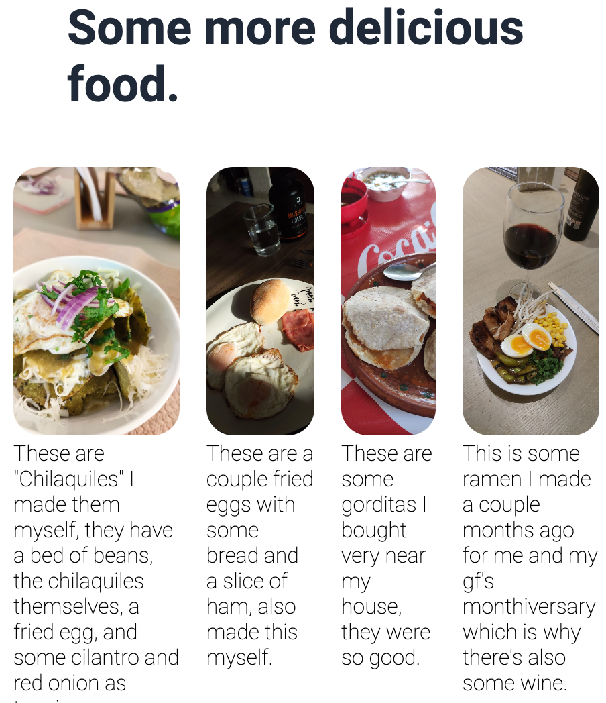
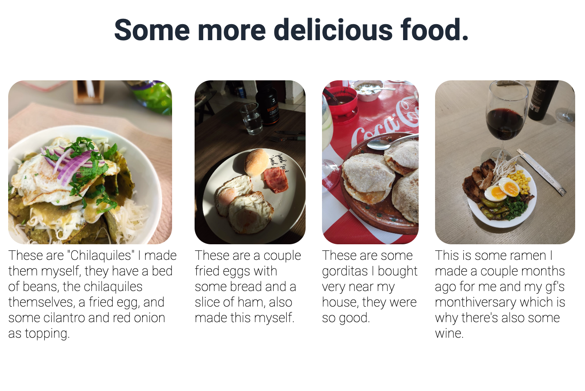

# Landing-Page-TOP
This is part of my "The Odin Project" foundations course, I coded my own html and css to try and clone the screenshot provided by the course and then I changed the contents into a food dedicated website because  I love food and I had a bunch of food pictures I took saved on my phone, so all of the content in the website is 100% original.

## Try it out!
https://ferm-boop.github.io/Landing-Page-TOP/

## Screenshot

